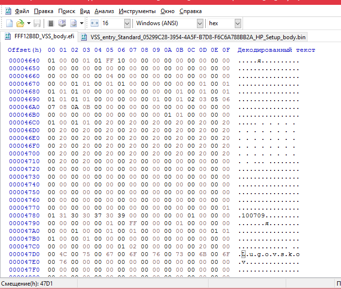

## VSS variable HP_Setup в FFF12B8D_VSS_body.efi

БОльшая часть настроек, выбираемых пользователем "в BIOS" в экранах меню, доступных по F2 при загрузке, и определяющих доступные изменению режимы работы устройств, вариантов загрузки и т.п. хранится в VSS переменной "HP_Setup". 

В частности, за задействование WiFi, WWWAN, Fingerprint - отвечают флаги-переменные, смещения которых перечислены в таблице в разделе [с портами USB](usb_ports.md)

FFF12B8D_VSS_body.efi - собственно целиком VSS store, хранилище VSS переменных. Внутри априори существует VSS variable HP_Setup, надо лишь найти смещение внутри.

Открываю в UefiTool NE a58 дамп BIOS. Ctrl+F, Text, "HP_Setup".

	Unicode text "HP_Setup" in VSS store/05299C28-3957-4C6F-F8AB-55A66586F04B at header-offset 20h
	Unicode text "HP_Setup" in VSS store/Invalid at header-offset 20h
	Unicode text "HP_Setup" in VSS store/Invalid at header-offset 20h
	Unicode text "HP_Setup" in VSS store/Invalid at header-offset 20h
	Unicode text "HP_Setup" in VSS store/Invalid at header-offset 20h
	Unicode text "HP_Setup" in VSS store/05299C28-3954-4A5F-B7D8-F6C6A788BB2A at header-offset 20h

Переменная HP_Setup - это которая с GUID: 05299C28-3954-4A5F-B7D8-F6C6A788BB2A, последняя в списке. Которые инвалиды - это её предыдущие варианты.

Информация о файле при клике на него - на правой панели - Base: 30464Ah, Offset: 4602h, Header size 32h (50)

Extract body.. "VSS_entry_Standard_05299C28-3954-4A5F-B7D8-F6C6A788BB2A_HP_Setup_body" открываю его и "FFF12B8D_VSS_body.efi" в соседних вкладках HxD.

По информации о файле "HP_Setup", в "FFF12B8D_VSS_body.efi" с 4602h+32h=4634h должно начинаться содержимое HP_Setup. Вроде да, но проверить бы. 

В теле переменной, "VSS_entry_Standard_05299C28-3954-4A5F-B7D8-F6C6A788BB2A_HP_Setup_body", есть строка Lugovskov в CHAR16. 
Первая 'L' по смещению 0x19D. 

0x19D + 4634h = 47D1h

Во вкладке HxD с "FFF12B8D_VSS_body.efi" прыгаю по смещению 47D1h

Отлично, BaseOffset_HP_Setup в VSS store найден, 4634h.

Setup Variables - 

