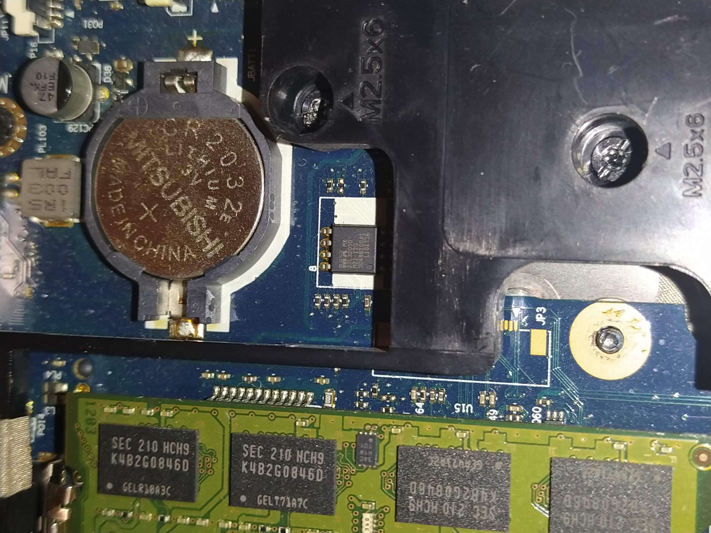

# Get BIOS 68CDD dump.

**ЛЮБОЕ ковыряние в BIOS необходимо начинать с создания бекапа содержимого конкретного компьютера.**

Хорошо, [посмотреть, что за WiFi оборудование в белом списке](whitelist_equipment.md) можно и в образе из [HP update BIOS 68CDD rev.F60 - latest and newest](https://ftp.hp.com/pub/softpaq/sp73501-74000/sp73934.exe).

Редактировать этот образ и заливать программатором в flash - вообще не вариант. 

Официальный программатор не признает редактированню прошивку - RSA подпись не будет валидна. Загнать образ патченной (без проверки .sig) официальной программой или SPI-программатором - c 99.9% веротности убить машинку, затрутся информационные блоки, характерные для конкретного экземпляра нотника - VSS, ME-region и иже с ними, да и сам BIOS - это только часть содержимого флешки.

Если нет SPI-программатора (как не было у меня), то варианты: либо сходить в сервис просить слить дамп (а потом возвращаться для прошивки редактированного), либо обзавестись собственным, поддерживающим работу с конкретной микросхемой.  

## Used SW

- Открытый проект SPI программатора на STM32 [stm32-vseprog](https://github.com/dword1511/stm32-vserprog) 
- [flashrom "serprog"](https://www.flashrom.org/) - впрочем, он как субмодуль vseprog идет
- Linux Mint, установленный на другом ноутбуке.
- [BIOS Backup ToolKit V2.0](https://www.google.com/search?q=BIOS+Backup+ToolKit+V2.0&oq=BIOS+Backup+ToolKit+V2.0) - утилита, сохраняющая без SPI-программатора содержимое BIOS
- [UEFI Tool NE alpha 58](https://github.com/LongSoft/UEFITool/releases/tag/A58) - утилита просмотра UEFI. 
- [Total commander](https://www.ghisler.com/)

## Микросхема flash с BIOS

Клавиатура крепится на трех винтах с нижней части корпуса нотника. Под ней - на фото ниже батарейки CR2032 - микросхема SPI flash **MX25L3205D**.

В репозиторий [положил datasheet](/doc/MX25L3205D%2C%203V%2C%2032Mb%2C%20v1.5.pdf) на эту микросхему, Macronix	MX25L3205D, SPI-flash, Voltage 2.700-3.600 V, 32 Mbit aka 4096kB. В [списке поддерживаемых flashrom](https://www.flashrom.org/Supported_hardware) она присутствует.

## SPI-программатор vserprog	

Ждать CH-314 c алиэкспресса - долго. Если найдется в закромах BluePill STM32F103C8T6, то, считай железная часть уже есть, FW программатора [stm32-vseprog](https://github.com/dword1511/stm32-vserprog) может быть откомпилировано с целевой платформой BluePill. Выпаивать чип для программирования, или припаиваться к ножкам - не хотелось, а клипса-прищепка для внутрисхемного программирования SOIC-8 [стоит в марте-2021](https://roboshop.spb.ru/tools/sop-8-clips) всего 250р. Лучше, конечно, было бы взять за 330р её же уже [с кабелем и переходником](https://roboshop.spb.ru/tools/sop-8-clips-cabel), если бы была в наличии. 

Немножко падеде танцев с бубном. Проект stm32-vseprog - под Linux. Нотник с Linux Mint, с которого я собирался читать-писать SPI flash, уже в наличии был. Вероятно, как-то завести программатор под виндой возможно - сам не пробовал, но, может кому-то пригодятся уже откомпилированные бинарники FW stm32-vseprog, в репозитории они в папке **/bin.prebuild.stm32vseprog**

Для прошивки BluePill нужен будет USB-TTL адаптер, у меня он на Prolific PL2303.

		$> lsusb
		...
		Bus 002 Device 013: ID 067b:2303 Prolific Technology, Inc. PL2303 Serial Port
		...
		
1. Install libpci headers, stm32flash и gcc-arm-none-eabi, если ранее не установлены были.

		$> apt search libpci
		$> apt install libpci-dev
		$> sudo apt-get install stm32flash gcc-arm-none-eabi
	   
2. Клонирую репозиторий проекта vseprog и собираю его под BluePill.

		$> cd ~/Work/
		$> git clone --recurse-submodules https://github.com/dword1511/stm32-vserprog.git
		$> cd stm32-vserprog
		$> make BOARD=stm32-bluepill

3. На скорости по-умолчанию прошить у меня не получилось, может, особенность конкретного USB-TTL адаптера. Add "**-b 115200 -m 8e1**" in **stm32-vseprog/Makefile** file in the next goal :

		flash-uart: $(HEX)
			stm32flash -b 115200 -m 8e1 -w $< -v $(SERIAL)

4. BluePill: set BOOT0 jumper to 1. Присоединяю USB-TTL адаптер к BluePill: 
- +3.3v --- +3.3v
- GND 	--- GND
- TX	--- A10 (31)
- RX	--- A9 (30)

Напутать на этом шаге можно только куда Tx и куда Rx. Если удалось напутать с землей-питанием, то, право, лучше прямо сейчас прекратить вот это всё, и отнести нотник в сервис, сопроводив ссылкой на этот репозиторий.

5. Запуск прошивки программатора - под sudo. Вместо прописанного в документации

          $> make BOARD=stm32-bluepill flash-uart
    must run as
	
          $> sudo make BOARD=stm32-bluepill flash-uart

6. После успешного окончания прошивки отсоединяю USB-TTL адаптер. BluePill: BOOT0 jumper set to 0.  Connect throw USB. If green led start flashing about 5-6 ticks per second - change your USB cabel, its damaged. PC13 LED must be on without flasing.

Проверяю появление SPI-программатора в устройствах (должен видеться как **ttyACM0**):

		$> ls /dev/ttyA*
		/dev/ttyACM0

7. Припаиваю провода к клипсе и к BluePill. **ВАЖНО! Всегда помнить - это программатор "на коленке", нет ни буферных резисторов на линиях ввода-вывода, ни защиты от дурака, который клипсу присоеденит "задом наперёд" - перепутав землю и питание**. 

Пара оранжевых проводов - к 3.3v через резистор 2к2, (подойдёт от 1к до 10к), на фото он в зеленой термоусадке.

В окончательном виде, с задутой термоусадкой.

 

8. На всякий случай в репозитории положил в */bin.prebuild.stm32vseprog*  полученные бинарники FW stm32-vseprog.

## Получение дампа прошивки.

Отсоединяю шнур питания и батарею ноутбука. Снимаю 3.3в. батарейку - CMOS слетит, при загрузке будет предупреждение, но внутренняя схематика платы мне неизвестна, мало ли где-то как-то эти вольты захотят выскочить. Присоединяю клипсу к микросхеме flash, соблюдая полярность. Включаю USP кабель программатора в нотник с Linux.

Ниже - сокращенный ввод команд, полный лог - [в репозитории](/res/flashrom_read.log).

		$> cd ~/Work/stm32-vserprog/flashrom$
		$> ./flashrom -p serprog:dev=/dev/ttyACM0

Ошибка, не может открыть порт. Запускаю из-под sudo.

		$> sudo ./flashrom -p serprog:dev=/dev/ttyACM0

Выводит список возможных вариантов микросхемы и просит конкретизировать - что же там стоит.

		$> sudo ./flashrom -p serprog:dev=/dev/ttyACM0:4000000 -c MX25L3205D/MX25L3208D -r ~/Work/hp_bios_original.bin

В файле **~/Work/hp_bios_original.bin** размером 4 194 304 байта содержимое флеш.

## Итоги.

Обратно на нотник с windows.

BIOS Backup ToolKit V2.0 - якобы сохраняет без SPI-программатора содержимое BIOS. Создаваемый им файл **Hewlett-Packard-68CDDVer.F.60.rom** занимает 2 621 440 байт.

Загрузив **hp_bios_original.bin** в UEFI tool A58, вижу, что собственно BIOS - это только часть дампа.

Сохраняю **Region_BIOS_BIOS_region.rgn** из UEFI tool: *BIOS region - RClick - Extract as is...*  Размер совпадает с **Hewlett-Packard-68CDDVer.F.60.rom**.

Проверяю насколько совпадает содержимое. В Total commander на противоположных панелях выделяю файлы, меню Файлы - Сравнить по содержимому.

Абсолютно одинаковы.

Т.е. получить область BIOS флешки, начинающуюся с offset: 180000h, можно и без программатора. Но вот залить обратно отредактированную, не имея полного бекапа - это русская рулетка.
