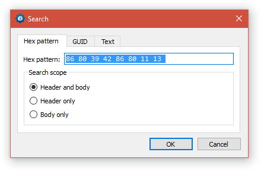
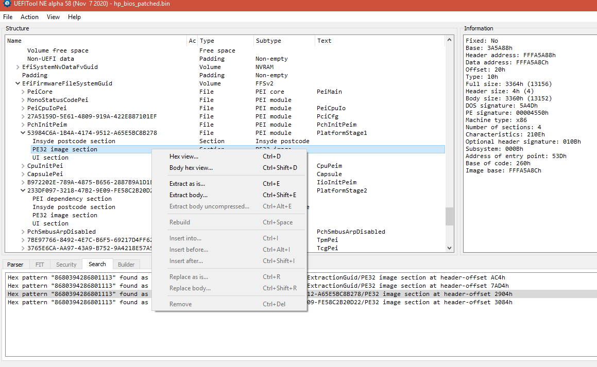

# Извлечение модулей, , /work/_0_extract_dxe.cmd

Слитый программатором [в предыдущей части](get_bios_dump.md) дамп биоса **hp_bios_original.bin** копирую под именем **hp_bios.bin** в папку **./work**. Из-за сочетания природной лени с природной же настойчивостью, цель - создать command файл, запуском которого извлекаются/создаются все необходимые файлы модулей: **/work/_0_extract_dxe.cmd**

- [Used SW](#used-sw)
- [Подмена в BIOS одного из VEN_DEV_SUBSYS в whitelist модулей.](#%D0%BF%D0%BE%D0%B4%D0%BC%D0%B5%D0%BD%D0%B0-%D0%B2-bios-%D0%BE%D0%B4%D0%BD%D0%BE%D0%B3%D0%BE-%D0%B8%D0%B7-ven_dev_subsys-%D0%B2-whitelist-%D0%BC%D0%BE%D0%B4%D1%83%D0%BB%D0%B5%D0%B9)

## Used SW
- Утилита UEFIExtract.exe из пакета [UEFI Tool NE alpha 58](https://github.com/LongSoft/UEFITool/releases/tag/A58).

## Подмена в BIOS одного из VEN_DEV_SUBSYS в whitelist модулей. 

Используя понимание [формата Whitelist WiFi HP](whitelist_hp6540b.md), ясно, что заменять можно любую запись в whitelist, кроме, пожалуй, родного модуля - чтобы сохранить возможность использовать и его.

Под замену назначаю самый первый, **Centrino Advanced-N 6200 2x2 AGN**. VEN 8086 : DEV 4239 : SUBSYS 13118086	FCCID: "PD9622ANHU".
Т.о. hex последовательность для поиска offset этой записи в **UEFI Tool NE alpha 58** будет выглядеть как **8680394286801113**.
Открываю в UEFIToolNE alpha 58 **./work/hp_bios.bin**. Меню *Action-Search*.

Да, пробелы для удобства чтения между значениями - допускаются. 

Найдено в 4 модулях: в DXE драйверах WLAN и PlatformSetup, в PEI-модулях PlatformStage1 и PlatformStage2.

		Hex pattern "8680394286801113" found as "8680394286801113" in EfiCrc32GuidedSectionExtractionGuid/PE32 image section at header-offset AC4h
		Hex pattern "8680394286801113" found as "8680394286801113" in EfiCrc32GuidedSectionExtractionGuid/PE32 image section at header-offset 7AD4h
		Hex pattern "8680394286801113" found as "8680394286801113" in 53984C6A-1B4A-4174-9512-A65E5BC8B278/PE32 image section at header-offset 2904h
		Hex pattern "8680394286801113" found as "8680394286801113" in 233DF097-3218-47B2-9E09-FE58C2B20D22/PE32 image section at header-offset 3084h

Интерфейс UEFITool хорош: даблклик на результат поиска синхронизирует главное окно, переводя к необходимому модулю.

	FileSystem GUID: 7A9354D9-0468-444A-81CE-0BF617D890DF (DXE том)
		|- File GUID: 4A538818-5AE0-4EB2-B2EB-488B23657022 - FvMainCompact
			|- Compressed section
				|- Raw section
					|- FileSystem GUID: 7A9354D9-0468-444A-81CE-0BF617D890DF 
						|- File GUID: 5EE86B35-0839-4A21-8845-F1ACB0F688AB - WLAN
						|- File GUID: F6D35FBB-63EA-4B25-81A5-5E62B4886292 - PlatformSetup
					
	 FileSystem GUID: 7A9354D9-0468-444A-81CE-0BF617D890DF (PEI том)
		|-	File GUID: 53984C6A-1B4A-4174-9512-A65E5BC8B278 - PlatformStage1
		|-	File GUID: 233DF097-3218-47B2-9E09-FE58C2B20D22 - PlatfirmStage2
	

Сохраняю "Extract body" модуля WLAN

Открываю в **HxD**, ищу смещение для hex последовательности *8680394286801113*, получаю offset= AC0h.

Ясно, при сохранении тела первые 4 байта отбросятся, и смещения, найденные в UefiTool нужно будет уменьшать на 4.

В **/work/_0_extract_dxe.cmd** 

		@echo -------------------------------------------------------
		@echo WLAN
		"../../_Utils/UEFITool A58/UEFIExtract.exe" hp_bios.bin 5EE86B35-0839-4A21-8845-F1ACB0F688AB -o efi -m body -t 10
		@mv -f ./efi/body.bin .
		@ren body.bin F6D35FBB-WLAN.efi
		@rm -f -r ./efi

UEFIExtract (да, он находится "выше" корня git) ищет в hp_bios.bin файл с GUID 5EE86B35-0839-4A21-8845-F1ACB0F688AB, извлекает его тело (-m body) типа 10h (полный перечень возможных значений см UEFIExtract --help) в создаваемую директорию ./efi/ с именем body.bin. Если efi существует - Error 34.
Переименовываю в F6D35FBB-WLAN.efi, перемещаю в ./work.

Аналогично - 53984C6A-PlatformStage1.efi и 233DF097-PlatformStage2.efi

вызываю **sub_1_1_wl_patch.cmd** для извлечения тел модулей.

---------------------------------

Задачи:
- заменить 
- Убрать самопроверку RSA подписи HP в BIOS

Результат прошлого шага - несколько файлов модулей с whitelist, модуль RSA чекера, хранилище VSS/NVRAM переменных целиком и файл с ACPI таблицами в папке **\work\patches\**.